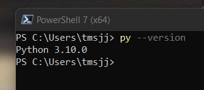
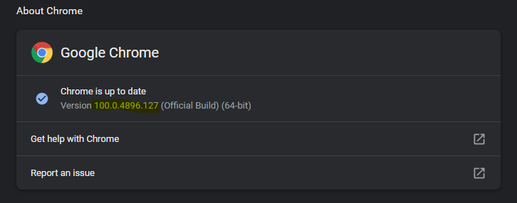

# Panda-Express-Survey-Filler-Bot (WINDOWS GUIDE)

How to use:
-Make sure python is installed on your system (on command prompt or powershell run this command)

If something similar like 'Python X.XX.X' appears then it is installed!
else follow this guide to install it -> https://www.youtube.com/watch?v=kIBPxiuBm1M

-Check the version of your chrome browser 
do this by pasting this 'chrome://settings/help' into the crhome searchBar & click enter

if it shows that it needs to get an update, update it and proceed to the next step

-Download the corresponding Chromedriver version
navigate to 'https://sites.google.com/chromium.org/driver/' and download the corresponding latest stable release

It is the corresponding version because both (in this example) chrome browser version and chromedriver version start with 100.X.XXXX.XXX
